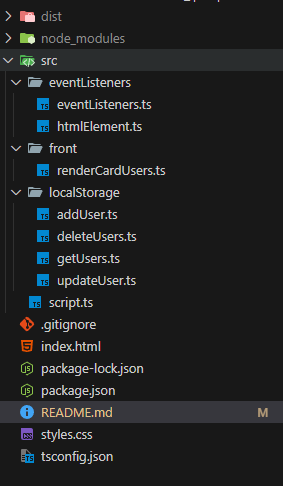

# TP-FINAL

Proyecto final en TypeScript que gestiona usuarios y roles con drag & drop y almacenamiento en LocalStorage.

## Estructura de carpetas



## Requisitos

- Node.js
- TypeScript

## Instalación

1. Clonar el repositorio:

```bash
git clone <https://github.com/JuanLaspiur/UTN_TP>

Node Versión 22.16.0

npm install

npm run build
